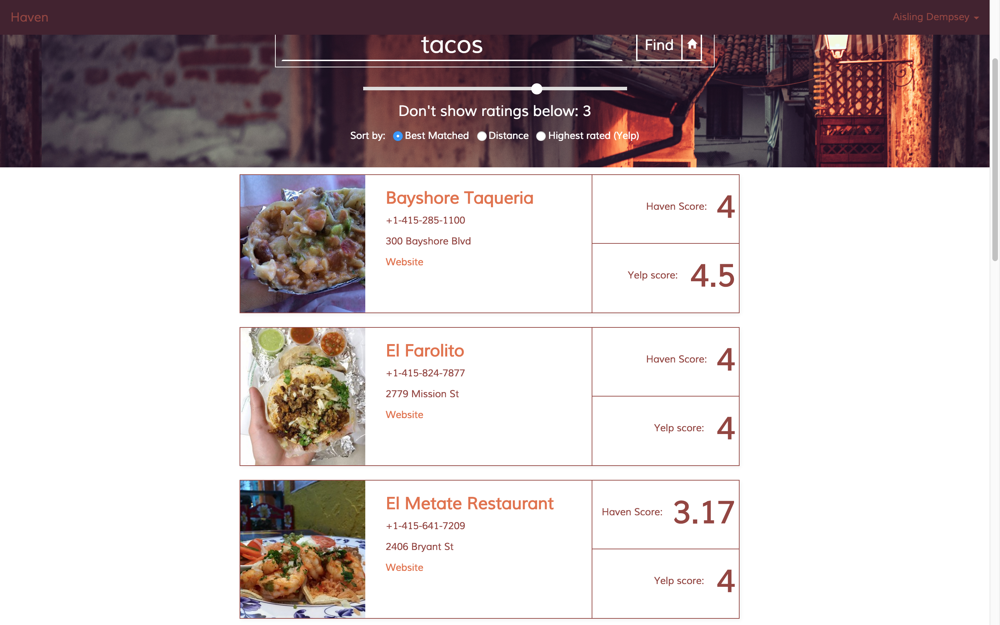
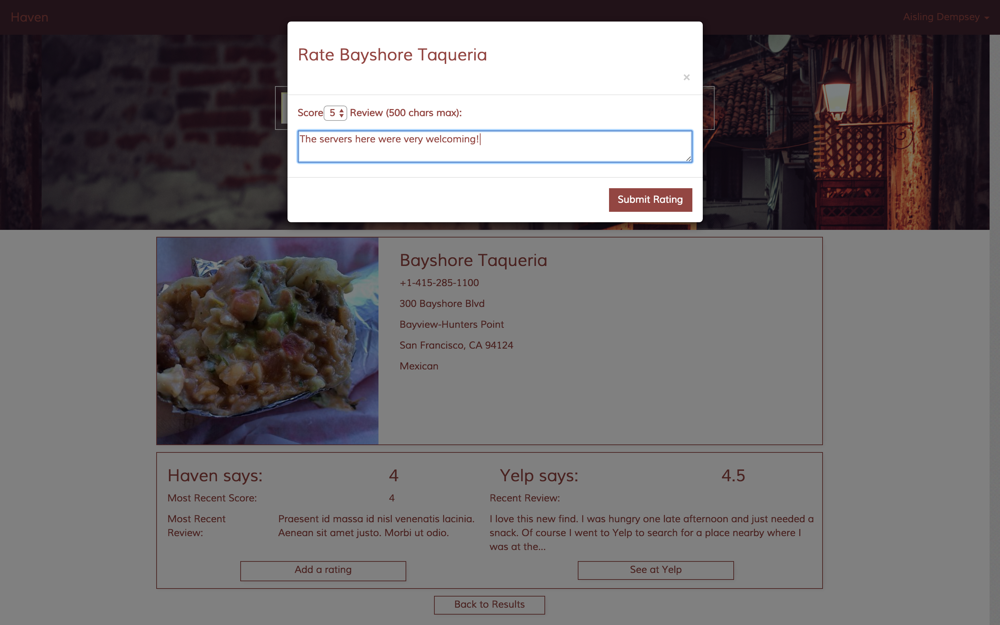

# Haven

Haven is a user-driven platform for members of the LGBT community to 
rate businesses for their inclusivity and discover inclusive businesses 
near them.

In its current form, Haven is set up as a proof of concept with a fake 
database of user ratings. 

Haven was conceived, engineered and designed by Aisling Dempsey as a 
student projet for Hackbright Academy.

#### Contents
- [Features](#features)
- [Flow](#flow)
- [Stack](#stack)
- [Disclaimer](#disclaimer)
- [Deployment](#deployment)

#### Flow
Users are greeted witha splash page showing both the search bar 
and the best local businesses:

They also get search results displayed in a clear, simple manner

Users are also able to add reviews and ratings when they are looking at a business' page:

#### Features
*Current*
- [x] Query Yelp by minumum Haven Score and according to Yelp sort parameters
- [x] Add business to Haven from Yelp
- [x] Add and update user review and score
- [x] Display best local businesses with minumum inclusivity cutoff
- [x] Data visualization of types of best local businesses with drilldown

*Future*
- [ ] Include safe restrooms from Refuge Restrooms
- [ ] Allow option to overlay heat map of hate crimes on all maps
- [ ] Have data visualization affect local business markers
 

#### Stack
Haven currenly uses the following Languages, Libraries, and APIs:
-  Python
-  Flask
-  Javascript
-  JQuery
-  PostGreSQL
-  SQLAlchemy
-  Mustache.js
-  Jinja2
-  Yelp API
-  Google Maps API
-  HighCharts
-  Bootstrap

#### Disclaimer
Haven in its current form is intended solely for demo-ing purposes. All user accounts and reviews are randomly generated and stored as plain-text for ease of debugging. If this were to be deployed, it would need passwords to be stored as hashes that were salted and peppered.

#### Deployment
At this time, Haven is not deployed.

#### Author
Aisling is a Software Engineer living in the Bay Area
